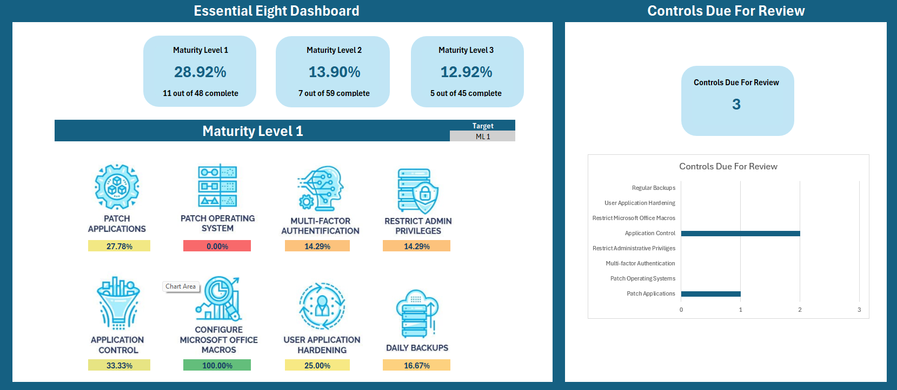
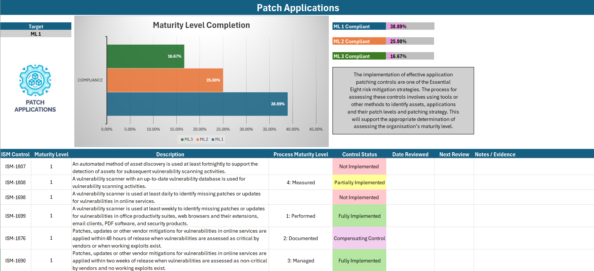

# Essential Eight Tracker

This Excel spreadsheet is designed to help organisations track their progress in implementing the Essential Eight cybersecurity strategies. It provides a clear, easy-to-read dashboard to capture the current status of your implementation, making it easier to identify areas that need improvement and to plan your next steps.

**Current version is based on the November 2023 Maturity Model.**

## What is the Essential Eight?

The Essential Eight are a set of baseline mitigation strategies recommended by the Australian Cyber Security Centre (ACSC) to help organizations protect themselves from various cyber threats.

1. **Application Whitelisting**: Ensures only approved applications can run on systems.
2. **Patch Applications**: Regularly update applications to fix security vulnerabilities.
3. **Configure Microsoft Office Macro Settings**: Control the use of macros to prevent malware.
4. **User Application Hardening**: Restrict or block risky applications and features.
5. **Restrict Administrative Privileges**: Minimize the use of administrative accounts.
6. **Patch Operating Systems**: Keep operating systems up-to-date with the latest security patches.
7. **Multi-Factor Authentication**: Implement additional verification methods to strengthen user authentication.
8. **Regular Backups**: Ensure critical data is backed up and can be restored.

## Features of the Tracker

- **Dashboard View**: A visual dashboard to quickly assess your overall implementation status.

- **Progress Tracking**: Monitor your progress for each of the Essential Eight strategies.

- **Auto Due Review Date**: Review due date automatically populated based on user preferences for months due.
- **Collaboration**: Share the tracker with your team to ensure everyone is on the same page.

## How to Use

1. **Download the Spreadsheet**: Clone the repository and open the Excel file.
2. **Input Your Data**: Fill in your current status for each of the Essential Eight strategies.
3. **Review the Dashboard**: Check the dashboard for a visual summary of your implementation status.
4. **Update Regularly**: Keep the tracker updated as you make progress in implementing the strategies.

## Contributing

I welcome contributions from the community to help improve this tracker. If you have suggestions, improvements, or new features to add, please follow these steps:

1. **Fork the Repository**: Create your own fork of the project.
2. **Create a Branch**: Make a new branch for your changes.
3. **Make Changes**: Implement your improvements.
4. **Submit a Pull Request**: Send a pull request with a detailed description of your changes.

## License

This project is licensed under the MIT License. See the LICENSE file for more details.

---

For more information on the Essential Eight, visit the [Australian Cyber Security Centre website](https://www.cyber.gov.au/resources-business-and-government/essential-cyber-security/essential-eight).

---
